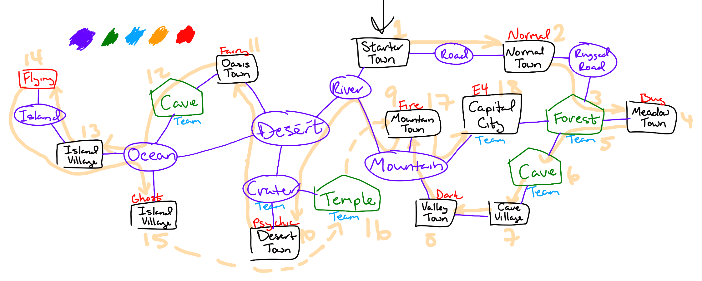

# Sketch
Long ago, a legendary Pokemon fell from space. It had an attunement to emotions, and was extremely susceptible to them, like the Sha. From this being came three legendaries, based on rage, rapture, and terror. Their presence inspire these emotions, which empower them, which inspire them, into a terrible loop.

When tensions grow between people in the region, the prime legendary awakens, causing the trio to awaken, causing tensions to overflow into war. Pokemon in general also grow more aggressive and leave their wilds to attack humans.

The legendaries are:
- Tositella "Emotion parent": Psychic/Ghost
- Vimma "Rage": Fire/Ghost
- Hulluus "Rapture": Poison/Ghost
- Kammo "Terror": Ice/Ghost

Tensions are high, and the Prime is soon to awaken.

# Background
In the Kosis (psychosis) region, catastrophic war is well known, and emotion is repressed — such repression does work in keeping the prime legendary Tositella asleep. Pokemon battling is thought to prevent emotions from bubbling over, but it is a necessary evil as competition is viewed as a way to spark conflict. The [Pokemon Ring](https://en.wikipedia.org/wiki/Kula_ringhttps://en.wikipedia.org/wiki/Kula_ring) is a quasi-governmental entity and ceremony dedicated to preserving peace.

There are two factions in Kosis: the Separatists, people who believe the Pokemon Ring is too close to government, and the Unionists, people who believe the government should *be* the Pokemon Ring. Both value repression higher than anything else.

The Pokemon Ring is a ceremony that takes place every four years where youths of around 17 are made to transit the eight gyms as Challengers and receive badges from them before challenging the current leader of the Ring, the Champion. The final two Challengers are said to be Rivals. Regardless of outcome of the final battle, the Ring is said to be complete when it concludes, and does not need to be done for another four years. The victor becomes the new or continuing Champion.

The Troubles were the last conflict, twenty years ago. It involved a near-failure of the Ring, when the Challenger and their Rival abstained from the final battle due to Separatist sentiments, and the secret manipulation of Team Conjure, who seek to control Tositella. The Troubles led to isolated but widespread fights across the region between factions, but it fortunately never overflowed into a full-on war, as the Challenger and Rival realized Conjure's effect and completed the Ring. Both Challenger and Rival traditionally wore masks to represent their role, but following the Troubles these were outlawed.

Gym leaders are leaders of Unionist cities, or government trainers in Separatist ones. Each has four trainers, mirroring the Elite Four and Champion fights, but they don't need to be fought gauntlet-style like the E4 do.

It's time for the next Ring, and tensions between factions have never been higher, thanks in part to Team Conjure's agitations. Separatists see the Troubles as an indication of the Ring being too close to government -- they should have fixed problems without needing Pokemon. Unionists see them as an indication of the Ring being too far -- if the government was all-in on the Pokemon Ring, then the Troubles couldn't have happened.

The player is a seventeen-year-old named Luke or Trish. Since battling is slightly taboo in Kosis, they have not received a Pokemon of their own yet, nor have they befriended one since they traditionally stay away. The unchosen gender is the player’s fraternal twin sibling. Their father is a veteran of the Troubles, and their mother runs a store and inn, but their father takes over when she's gone. *Secretly, their parents were the Challenger and Rival; due to the old mask tradition, few know this.*

## The Pokemon Ring
- Traditionally parents of Challengers provide an heirloom Pokemon as their starter.
- The Ring doesn't need to be done in a specific order.

# Story
The game begins on the day of the Challenger Festival, which begins the Pokemon Ring for the year, in a Separatist town. As twins, both siblings are made Challengers. They do some sort of game before it officially begins. Their parents allow them both to select a Pokemon for their starter, either:
- Snivy (Grass), Fennekin (Fire/Psychic), Piplup (Water/Steel)
- Leafawn/stag/moose (fawn/deer/moose) *(Grass/Steel)*, Flikker/Flairy/Feullet (ball/spookyball/will-o-wisp) *(Fire/Fairy)*, //Sonarca (manatee calf/beluga/orca) *(Water/Ice)*

The player's twin takes the type advantage, and their mother takes the type disadvantage, which can be seen at home the rest of the game and evolves after certain badges; this is because she is fighting Conjure in the background.

The player begins the Ring, and their twin splits up to begin too. There are other Challengers beginning in other places.

In brief:
1. Starter Town. Rural. Separatist. Where the game begins.
2. Normal Town. Rural. Unionist.
    - Normal gym.
3. Forest, visit 1.
4. Meadow Town. Unionist.
    - Bug gym.
5. Forest, visit 2.
    - Brief team encounter.
6. Cave.
    - Team encounter.
7. Cave Village. Unionist.
8. Valley Town. Just outside the cave. Unionist.
    - Dark gym.
9. Mountain Town. Unionist.
    - Fire gym.
10. Desert Town via Crater w/ Team encounter. Separatist. *Could this be a tundra instead of a hot sandy desert?*
    - Psychic gym.
11. Oasis Town. Separatist. *If a tundra, this could be a hot spring instead.*
    - Fairy gym.
12. Cave.
    - Team encounter.
13. Island Village 1. Separatist.
14. Island route.
    - Flying gym.
15. Island Village 2. Separatist.
    - Ghost gym.
    - Team encounter.
16. Crater Temple.
    - Team encounter. Prime and three emotions unintentionally awoken and released.
17. Mountain Town, visit 2.
18. Capital City. Unionist.
    - Team encounter.
    - Elite Four. Champion defeated by Team Rival, who immediately abandons the role of Champion to destabilize Kosis. There's no protocol for a refusing Champion, so the player's Ring cannot be completed.
19. (Not currently on sketch) Crater Temple. Player pursuing Team Rival.
    - Team finale: vs. Team Rival, and Team Leader. Return to Capital City for recording champion team.

## Locations
- Forest
- Cave between Forest and Valley Town, contains Cave Town
- Mountains that divide half of the region between wet and dry
- River that can be followed from the Mountains through the desert. HM Dive allows passage under the Desert straight to the ocean.
- Desert/Tundra
- BIG crater where Tositella landed. Now the site of a tourist shop with a telescope, [Meteor Crater](https://en.wikipedia.org/wiki/Meteor_Crater)-style (that impactor was 50 m across; this makes it bigger than Eternatus, which is 20 m (though landed on Pokearth as 100 m)), as well as a secret almost-religious temple dedicated to emotional repression at the bottom. Unown feature. Probably close to the final area, or at least the temple is. NOT Tunguska, since that was in Russia.
- Ocean
- Islands
- ? Burning town; one side set fire pokemon loose on it, and now ghost pokemon roam too. Vimma spotted.

## Characters
- Mom: Former Challenger. Runs a store and inn. Her partner Pokemon during the Ring was a Mismagius.
- Dad: Former Challenger, veteran of the Troubles. Helps Mom. His partner Pokemon during the Ring was a Kilowattrel.
- Twin: Current Challenger. Somewhat serious, somewhat competitive. Rival.
- Team Rival: Current Challenger, secretly working for Team Conjure. Trying to beat the Champion so he can destabilize the factions.
- Professor Poplar: Pokemon professor. Studying Pokemon emotions, and the effect of human emotions on them.

# Battles
## Gyms
1. Normal
2. Bug
3. Dark
4. Fire
5. Psychic
6. Fairy
7. Flying
8. Ghost

## Elite Four + Champion
1. Poison
2. Ground
3. Rock
4. Fighting

5. Flying and Ghost are neutral for all starters

# Kosis Region
The region is based on Eastern Europe, which debatably includes Estonia.